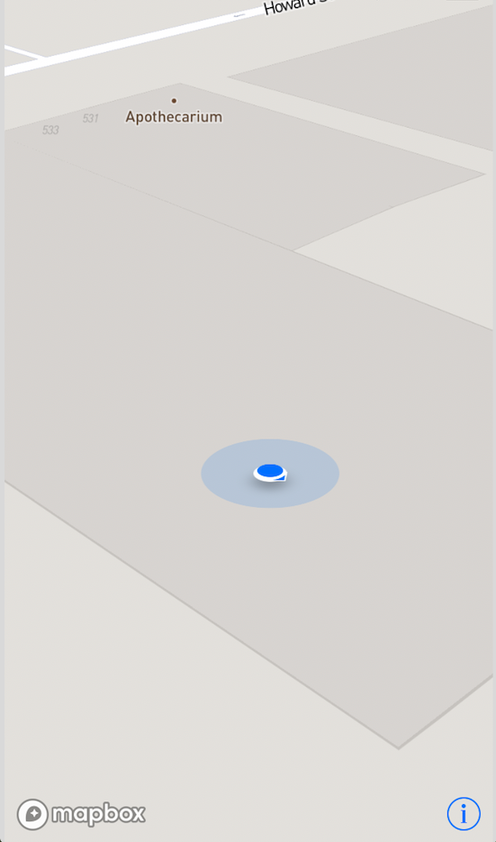

This is an example of Navisens' SDK integration with MapBox's SDK.

Get a key for the iOS Mapbox SDK [here](https://www.mapbox.com/account/).  
And add it to the Info.plist [here](https://www.mapbox.com/install/ios/cocoapods-permission/).

Then retrieve a Navisens SDK key [here](https://navisens.com/).  
And add it to the `runMotionDna` method in the `MotionDnaController.swift` file.

When you are done with all your key retrievals, run:
```
pod install // Will install MotionDna SDK and MapBox SDK
open mapbox-helloworld.xcworkspace // Will launch xcode
```

After completing these steps should be seeing the Navisens position on the MapBox canvas.

Have fun!



